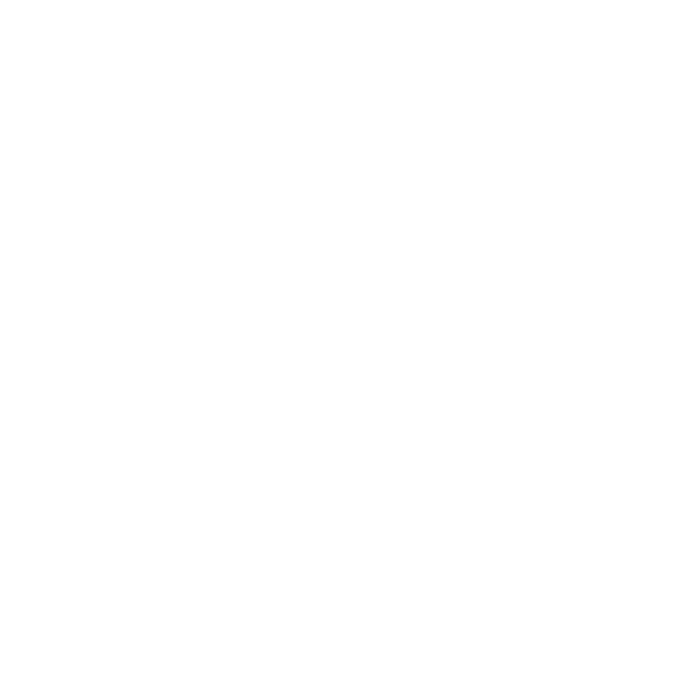
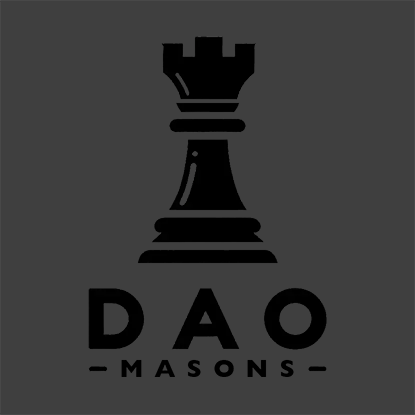

# Grant Ships Web App




[App](https://app.grantships.fun/) | [About](https://grantships.fun/) | [Telegram](https://t.me/grantships) | [Discord](https://discord.gg/bB6cZmxm) | [Twitter](https://twitter.com/grantships)

## Description

The Grant Ships app is the primary way users (Facilitators, Ship Operators, and Project Leads) interact with the Grant Ship smart contracts.

### Application Design Principles

- **Ease of use:** Despite the range of functionality within this application, it should feel simple and easy to use.
- **Immutable state:** All of the data featured in this application should be sourced or indexed from IPFS and the various onchain protocols that we interact with. We aim to not utilize any centralized or siloed stores of data that do not already exist onchain or on decentralized storage (IPFS).
- **Full transparency:** A decentralized grants framework should display as much relevant data as possible. This includes the reasoning and human intentions behind actions that are taken.
- **Role Clarity:** The application should direct the user to functionality and data that is relevant to their role within Grant Ships.
- **Self-contained:** All of the functionality required to play Grant Ships should be included within one application.
- **UX First:** Developers should strive to implement the simplest possible solutions to satisfy user demand. All of our design decisions (dependencies, architecture, patterns) should aim to add only the features that directly satisfy user demand while using the smallest amount of dependencies.
- **Development Speed:** This app is in its early stages of development. We therefore prioritize the speed of feature development and changes over the perfect execution of code organization and design patterns. We will refactor to more stable and sustainable patterns once we more clearly understand the needs of our users.
- **Fun:** While the initial release of the Grant Ships application currently prioritizes function over form, we aim to gamify the experience and make it more fun to use over time.

### Frontend Stack:

- Languages: Typescript, Graphql, TSX
- Framework: React/Vite
- [mantine](https://mantine.dev/) for components & macro elements
- [wagmi](https://wagmi.sh/) convenience hooks for interacting with smart contracts
- [viem](https://viem.sh/) for interacting with smart contracts
- [@graphprotocol/client-cli](https://github.com/graphprotocol/graph-client) for GraphQL type generation and schema stitching
- [local-forage](https://localforage.github.io/localForage/) for caching metadata

### Onchain Interactions:

- **[Allo V2](https://allo.gitcoin.co/)**: We use Allo Protocol to build fully onchain, decentralized Grants programs. Read more about our custom Allo strategies [here](https://github.com/DAOmasons/allo-v2/tree/main/contracts/strategies/_poc/grant-ships).
- **[Hats Protocol](https://www.hatsprotocol.xyz/):** Hats Protocol is a powerful, composable, and capture-resistant tool for managing roles and permissions within Grant Ships.

## Installation

1. Clone the repos
2. Navigate to the project directory
3. Add environment variables following the pattern described in `.sample.env`
4. Install dependencies

```bash
yarn
```

5. Start the development server

```bash
yarn dev
```

## Usage

For a detailed guide on how to use Grant Ships, see our [rulebook](https://rules.grantships.fun/)

## Roadmap

For a detailed breakdown of the fixes, features, and tasks we aim to address in the short term, please feel free to read our Grant Ships Product Development board here.

### Mid/Long term goals

- Voting interface
- UX improvements and gamification enhancements
- UI revamp and style improvements (gamification)
- Offload data sourcing/caching/parsing to a stateless backend API.
- Better project labeling, sorting, filtering
- Community review system for projects and ships
- Badges for recognition
- Better data input and display (Markdown, Funding visualization, user reviews, project updates)
- Solidifying application architecture and code patterns
- Monorepo to organize our many grant ship repos
- Code style guide

## Authors and Acknowledgement

- Jord: Lead developer & product manager
- Sun Jo: Designer
- UI369: Lead QA engineer, documentation & community support
- Boilerrat: QA, documentation and community support

### Special Thanks:

- Plurality Labs & Arbitrum DAO: Principle funders for this early-stage project.
- Allo Protocol: Tech support, code reviews, assistance.
- Hats Protocol: Support, assistance with onchain development, and community stewardship.

## License

[GNU V3](license.md)

## Project Status

**Shipped!** Early production Beta release. Visit the [app](https://app.grantships.fun/) to see Grant Ships in action!



DAO Masons is a small, independent service and tooling guild. Our mission is to help DAOs win. We focus on the key issues facing DAOs today and implement systems that make DAOs more accessible, functional, and exceptional.

[Website](https://www.daomasons.com/) | [Discord](https://discord.gg/bB6cZmxm) | [Twitter](https://twitter.com/daomasons) | [daomasons@gmail.com](mailto:daomasons@gmail.com)
